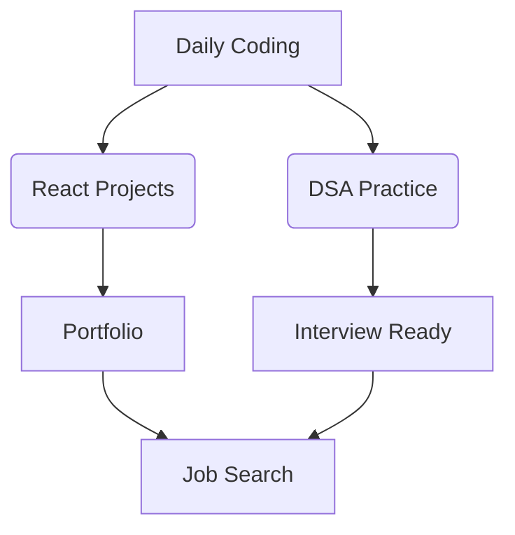
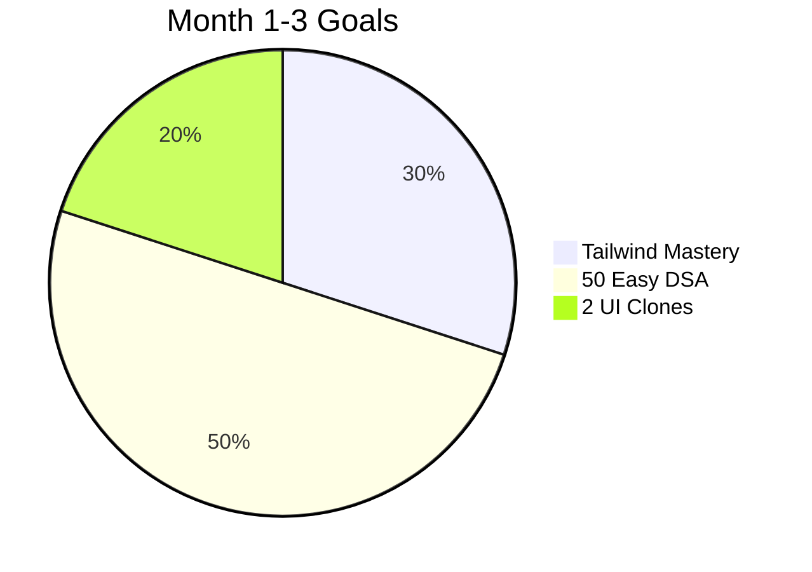
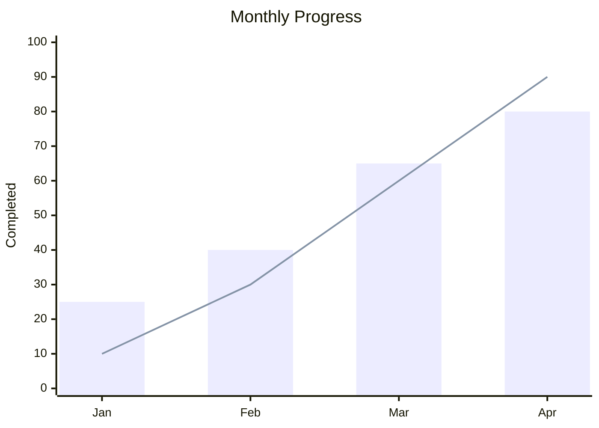
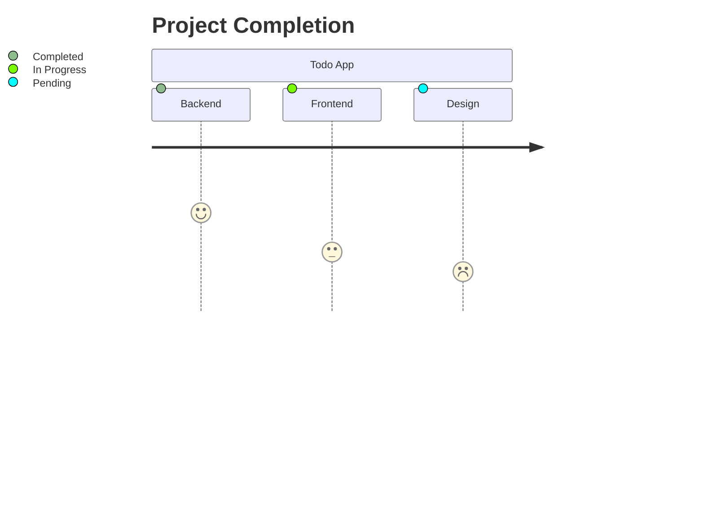

# 🚀 Lucky's 12-Month Web Dev + DSA Mastery Tracker

<div align="center">
  
  
  
  
</div>

<div align="center">
  <a href="#-weekly-planner">📅 Weekly Planner</a> •
  <a href="#-monthly-milestones">🗓 Monthly Milestones</a> •
  <a href="#-resources">📚 Resources</a> •
  <a href="#-notion-integration">🖇 Notion Setup</a> •
  <a href="#-progress-dashboard">📊 Dashboard</a>
</div>

---

## 🌟 Overview
An interactive, visually-rich tracker for my full-stack development journey featuring:



**Key Features:**
- ✅ Visual progress tracking
- ✅ Notion sync capabilities
- ✅ Interactive schedule planner
- ✅ Curated resource library
- ✅ Motivation system

[](https://notion.so/template)

---

## 📅 Weekly Planner

**Color-Coded Priority System:**
- 🔴 High Priority
- 🟡 Medium Priority
- 🔵 Low Priority

| Day       | Tasks                                                                 | Time   | Status |
|-----------|-----------------------------------------------------------------------|--------|--------|
| **Monday**    | 🧠 DSA: Arrays/String (1 Easy+Medium)<br>🔧 React: Component Building | 2 hrs  | ⬜     |
| **Tuesday**   | 🧠 DSA: HashMaps<br>⚛ React: Hooks Implementation                    | 2 hrs  | ⬜     |
| **Wednesday** | 🧠 DSA: Sliding Window<br>🎨 UI: Color Palette Design                | 2 hrs  | ⬜     |
| **Thursday**  | 🧠 DSA: Recursion<br>🛠 API: Firebase Integration                     | 2 hrs  | ⬜     |
| **Friday**    | 🧠 DSA: Sorting<br>🚀 Deployment: Vercel Push                         | 2 hrs  | ⬜     |
| **Weekend**   | 🧪 Mock Interview<br>🖥 Design Clone                                  | 3-4 hrs| ⬜     |

**Progress Controls:**
```javascript
// Sample tracking function
function updateProgress(task, status) {
  const tasks = getTasks();
  const updated = tasks.map(t => 
    t.id === task.id ? {...t, status} : t
  );
  saveProgress(updated);
}
```

---

## 🗓 Monthly Milestones

### Phase 1: Foundation (Month 1-3)


### Phase 2: Building (Month 4-6)
- [ ] Build Todo App with Firebase
- [ ] Complete 100 DSA problems
- [ ] Implement 3 custom hooks

### Phase 3: Advanced (Month 7-9)
- [ ] Portfolio website v2.0
- [ ] 20 Hard DSA problems
- [ ] Freelance profile setup

### Phase 4: Career (Month 10-12)
- [ ] Launch 4 production projects
- [ ] 150+ DSA solved
- [ ] Job applications

---

## 📚 Resources

### DSA Learning Path
1. **Beginner**
   - [JavaScript Algorithms](https://javascript.info/algorithms)
   - [LeetCode Easy Patterns](https://leetcode.com/explore/interview/card/leetcodes-interview-crash-course-data-structures-and-algorithms/)

2. **Intermediate**
   - [NeetCode 150](https://neetcode.io)
   - [Design Gurus](https://www.designgurus.io)

### React Ecosystem
| Tool | Description | Badge |
|------|-------------|-------|
| [shadcn/ui](https://ui.shadcn.com) | Beautiful components |  |
| [Framer Motion](https://framer.com/motion) | Animations |  |

### Design Assets
```color-palette
#6366f1 (Primary Purple)
#10b981 (Emerald)
#3b82f6 (Blue)
#f59e0b (Amber)
#ef4444 (Red)
```

---

## 🖇 Notion Integration

**Setup Guide:**
1. [Duplicate template](https://notion.so/template)
2. Connect with GitHub using:
   ```bash
   notion-integration connect --token YOUR_TOKEN
   ```
3. Enable auto-sync:
   ```bash
   npm run sync-notion
   ```

**Notion Features:**
- 🎯 Interactive Kanban board
- 📅 Calendar view
- 📊 Progress analytics
- 💾 Code snippet database

---

## 📊 Progress Dashboard

**Current Stats:**


**Legend:**
- Bars: DSA Problems
- Line: Projects Completed

---

## 🛠 Setup & Usage

1. **Install dependencies:**
   ```bash
   npm install -g notion-cli progress-tracker
   ```

2. **Configure your tracker:**
   ```bash
   tracker init --dsa-goal 300 --projects 6
   ```

3. **Daily commands:**
   ```bash
   # Start tracking
   tracker start --task "DSA Problem"
   
   # Update status
   tracker update --complete "React Component"
   
   # Generate report
   tracker report --week 25
   ```

---

## 🎨 UI Components Preview

**Progress Card Component:**
```jsx
<ProgressCard 
  title="DSA Mastery" 
  current={45}
  goal={300}
  color="#6366f1"
  icon="🧠"
/>
```

**Project Status:**


---

<div align="center">
  <h3>Keep the Momentum Going!</h3>
  <blockquote>
  "Consistency transforms ordinary into extraordinary" — Lucky
  </blockquote>
  
  [](https://twitter.com/yourhandle)
  [](https://github.com/yourrepo)
</div>
