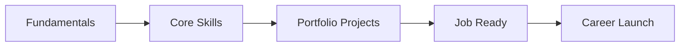
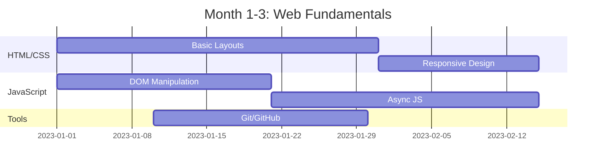
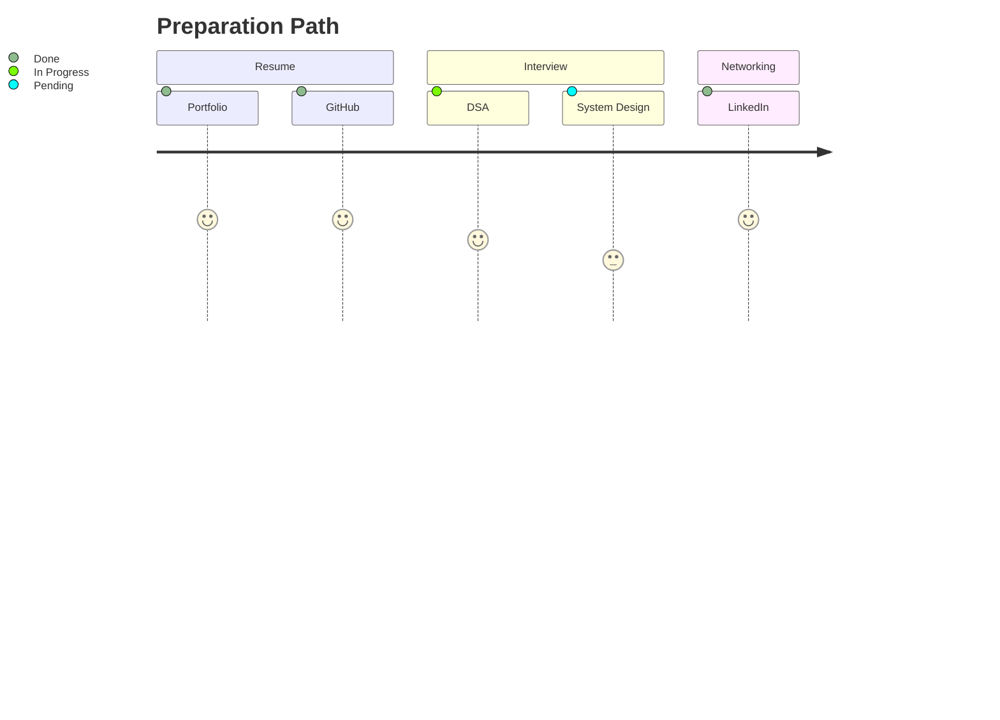
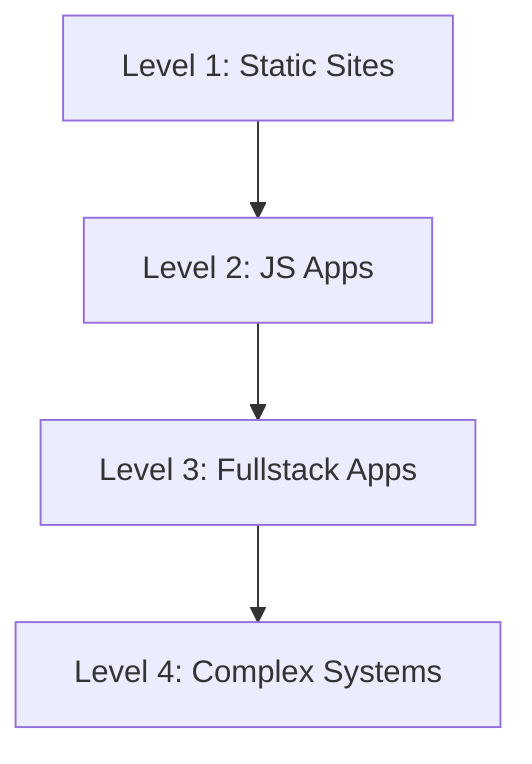
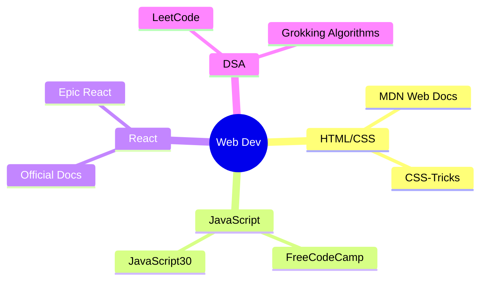

# 🚀 Web Dev + DSA Mastery Roadmap for Beginners

<div align="center">
  
  
  
</div>

<div align="center">
  <a href="#-learning-phases">📚 Learning Phases</a> •
  <a href="#-weekly-framework">🗓 Weekly Framework</a> •
  <a href="#-project-milestones">🚀 Projects</a> •
  <a href="#-resource-guide">🔍 Resources</a> •
  <a href="#-progress-system">📈 Tracking</a>
</div>

---

## 🌟 Learning Strategy
**Project-First Approach** - Learn concepts through building rather than theory-first  
**Progressive Difficulty** - Start with fundamentals before advanced topics  
**Active Recall** - Weekly review sessions to reinforce learning  



---

## 📚 Learning Phases (Month-by-Month)

### 🧱 Foundation Phase (Month 1-3)


**Goals:**
- Build 3 static websites
- Complete JavaScript coding challenges
- Learn Chrome DevTools

---

### ⚙️ Core Skills Phase (Month 4-6)


```mermaid
pie
    title Month 4-6 Focus Areas
    “React Fundamentals†: 35
    “Basic DSA†: 30
    “APIs†: 25
    “UI/UX Principles†: 10
```

**Projects:**
1. Weather app with API integration
2. Todo list with local storage
3. E-commerce product page

---

### 🚀 Portfolio Phase (Month 7-9)
**Build:**
- Full-stack application (MERN stack)
- Open-source contribution
- Clone of popular site (Netflix/Spotify UI)

**DSA Focus:**
- Solve 3 problems weekly
- Focus on patterns: Sliding Window, Two Pointers

---

### 💼 Job Ready Phase (Month 10-12)


---

## 🗓 Weekly Framework

| Day       | Focus Area                  | Task Examples                          | Time   |
|-----------|-----------------------------|----------------------------------------|--------|
| **Mon**   | Core Concepts               | Learn React hooks, CSS Grid tutorial   | 90 min |
| **Tue**   | DSA Practice               | 1 LeetCode Easy problem                | 60 min |
| **Wed**   | Project Work               | Build authentication flow              | 2 hrs  |
| **Thu**   | Review & Refactor          | Code optimization, debug previous work| 90 min |
| **Fri**   | New Technology             | Explore new library (e.g. Redux)       | 60 min |
| **Sat**   | Creative Project           | UI design challenge                    | 2 hrs  |
| **Sun**   | Rest & Planning            | Weekly review, plan next week          | 30 min |

**Key:**  
🔴 = Critical | 🟡 = Important | 🔵 = Bonus

---

## 🚀 Project Milestones

### Tiered Project Approach:


1. **Beginner Projects**
   - Personal portfolio
   - Restaurant menu page
   - Calculator app

2. **Intermediate Projects**
   - Movie database browser
   - Real-time chat app
   - E-commerce cart

3. **Advanced Portfolio Pieces**
   - Social media clone
   - Stock trading dashboard
   - AI-powered application

---

## 🔍 Resource Guide

### Essential Learning Path:


### Tool Recommendations:
| Purpose       | Tools                                                                 |
|---------------|-----------------------------------------------------------------------|
| **CSS**       | Tailwind, CSS Modules, Sass                                          |
| **Deployment**| Vercel, Netlify, GitHub Pages                                        |
| **Design**    | Figma, Coolors, Undraw illustrations                                 |
| **Backend**   | Express, Firebase, MongoDB                                           |

---

## 📈 Progress System

### Tracking Metrics:
```mermaid
xychart-beta
    title “Monthly Progress Tracker”
    x-axis [1, 2, 3, 4, 5, 6]
    y-axis “Completion %” 0 --> 100
    bar [15, 30, 45, 60, 75, 90]
    line [10, 25, 50, 70, 85, 95]
```

**How to track:**
1. Weekly GitHub commits
2. LeetCode progress tracker
3. Project completion checklist
4. Learning journal entries

### Notion Template:
[](https://notion.so/template)

---

## 💡 Motivation Tips

1. **Celebrate micro-wins** - Completed a tricky problem? Share it!
2. **Pair programming** - Join communities like freeCodeCamp
3. **80/20 Rule** - Focus on high-impact technologies (React, Node, JS)
4. **Build in public** - Document your journey on Twitter/Dev.to

<div align="center">
  <blockquote>
  "The expert in anything was once a beginner" - Start today!
  </blockquote>
</div>
```
